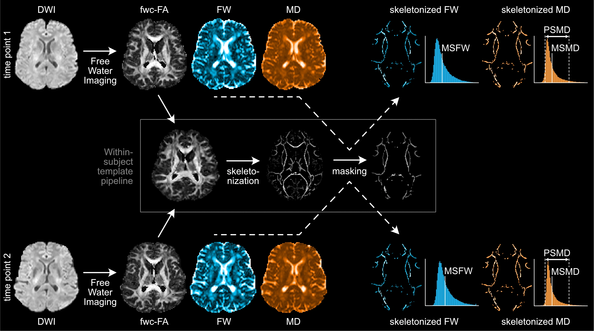

# DELTA-SVD

**Diffusion Endpoints for Longitudinal Tracking of white matter Alterations in cerebral Small Vessel Disease**

DELTA-SVD is a containerised pipeline for deriving diffusion MRI endpoints suitable for longitudinal tracking of white matter change in cerebral small vessel disease.



## Usage

DELTA-SVD runs as a container whose entry point is the pipeline script. The general usage pattern is:

```
apptainer run delta-svd.sif --dwi <image> --id <subject> [options]
```

**See the [**documentation**](https://delta-svd.com) for full details on requirements, installation and usage.**

## License

This project's own code is licensed under CC BY-NC-ND 4.0 (non-commercial, no derivatives). See [LICENSE](LICENSE) for details, including attribution requirements.

> [!IMPORTANT]
> If you use DELTA-SVD, the [license](LICENSE) requires you to both cite the method publication and link to this repository:
>
> 1. **Publication** — Dewenter A, et al. (manuscript submitted). Full citation details will be provided here upon publication.
> 2. **Repository** — https://github.com/isdneuroimaging/DELTA-SVD

## Third-party software

The container image bundles several third-party dependencies, notably FSL and ANTs. FSL is non-commercial-use-only; by using the image you agree to be bound by its license. See [NOTICE](NOTICE) for details and license texts.

## Disclaimer

**Research use only, not a medical device.** DELTA-SVD is intended solely for research. It is not a medical device, has not been reviewed or approved by any regulatory authority, and must not be used for clinical diagnosis, treatment, or other medical decisions. The software is provided "as is", without warranty of any kind; to the fullest extent permitted by law, the authors accept no liability for any damages arising from its use.